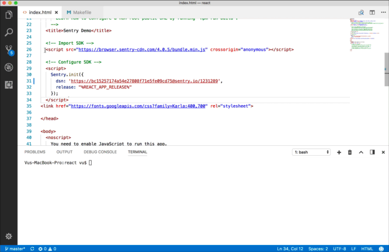

# sentry-demos/react


## Versions Summary:

| dependency      | version           
| ------------- |:-------------:| 
| node      | 14.2.0  |
| sentry-cli   | 1.53.0    |
| macOS | Catalina 10.15.3      |
| docker   | 19.03.8     |

## Goal/Summary:
Show how Sentry works
- Import/Integrate
- Configuration
- Releases/SourceMaps/Commits
- Session + Transcation Tracing (correlate errors across FE, BE, etc.)

## First-time Setup
1. Use the nvmrc file to set a compatible node version.
```
nvm use
```

2. Install dependencies
```
npm install
```

3. Configure Sentry with your `PUBLIC_DSN_KEY` in index.html
4. Remember to include your `SENTRY_AUTH_TOKEN`; you'll need to generate one
first from your Sentry server. After doing so, a cheap and easy way to use the
token would be this: `export SENTRY_AUTH_TOKEN=1010101011010101`
5. Make sure that your Github repo is integrated into your Sentry organization.
6. Enter your Sentry organization slug in the `SENTRY_ORG` line of your Makefile,
then add the name of `SENTRY_PROJECT`

## Run
```
$ npm run deploy
```
1. Go to http://localhost:5000 in your browser and begin throwing errors/events to Sentry!



2. You can run this demo in 2 ways. 1st is to generative a standalone error in Javascript by clicking Checkout. 2nd is to generate errors in both Javascript and Python (Flask) https://github.com/sentry-demos/flask by clicking Checkout.

The difference is controlled by the `REACT_APP_WORKFLOW` variable in `.env`. This request can be made to any of the back-end /sentry-demos.

`REACT_APP_WORKFLOW=false` calls https://neilmanvar-flask-m3uuizd7iq-uc.a.run.app/checkout, see components/app.js as to why this is happening.

`REACT_APP_WORKFLOW=true` causes it to error on this.codeNotPerfect and does not call back-end

#### Gotcha's

Gotcha1 if you're trying to call Flask running locally on your computer, then go into components/app.js and manually edit the `IS_WORKFLOW_DEMO` variable because it defaults to the gcp url every time.

Gotcha2 comments are not supported in .env  
`REACT_APP_WORKFLOW=false # To enable checkout flow` is evaluated as `false # To enable checkout flow` not `false`

Gotcha3 you need to rename your .env's `REACT_APP_WORKFLOW` to `REACT_APP_IS_WORKFLOW_DEMO` which is what app.js says.

Gotcha4 the command is `make deploy_gcp` not `make deploy_to_gcp` like the README says.

Gotcha5 - `REACT_APP_BACKEND` value needs to have `https://******-flask-errors-********run.app` nd not `https://******-flask-********run.app` in it, because in sentry-demos/flask/Makefile it's defined as `flask-errors`

## Run With Docker

```
$ docker-compose up
```
1. Go to http://localhost:3005 in your browser and begin throwing errors/events to Sentry!


## Tracing


## Deploy to Google Cloud Run:
```
$ make deploy_to_gcp
```
